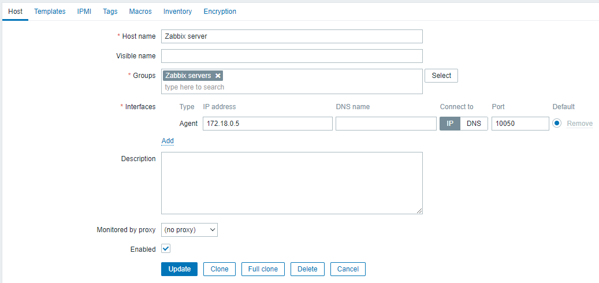
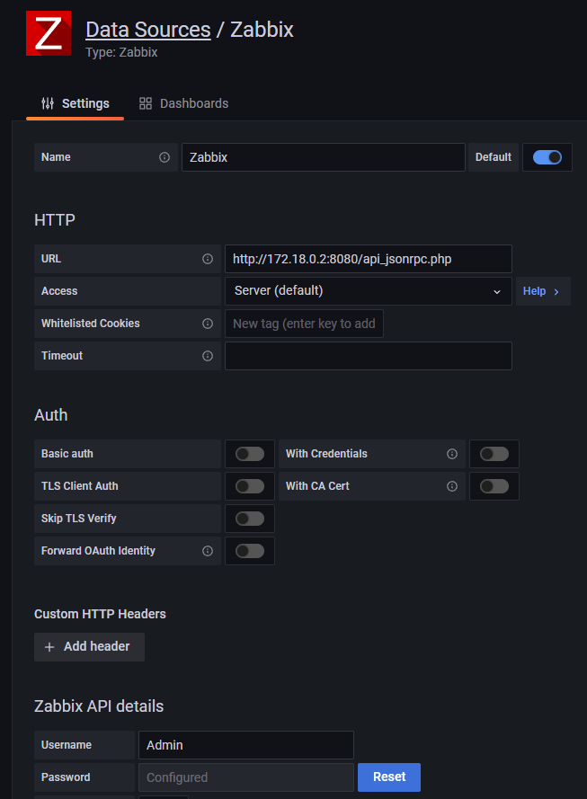
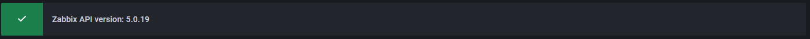

<br/>
<p align="center">
  <a href="https://github.com/RomainGL/docker-zabbix-grafana">
    
  </a>

  <h2 align="center">Docker Zabbix Grafana MySQL NGINX </h2>

  <h3 align="center">
    a ready-to-use environment to carry out practical work or tests.
    <br/>
    <br/>
    </h3>
</p>


## Table Of Contents

* [About the Project](#about-the-project)
* [Built With](#built-with)
* [Getting Started](#getting-started)
  * [Prerequisites](#prerequisites)
  * [Installation](#installation)
* [Usage](#usage)
  * [default login](#default-login)
  * [parameter to enter](#parameter-to-enter)

## About The Project

Being in the last year of a master's degree, our study group decided to work on supervision as well as metrology.

Following the creation of practical work, we needed a ready-to-use work environment so that future students could work with the same tools.

## Built With

- Zabbix Server 5.0.19
- Zabbix Frontend NGINX 5.0.19
- Zabbix Agent2 5.0.19
- MySQL 5.7
- Grafana 9.3.2

## Getting Started

For installation we need:
- Git
- Docker Desktop

### Prerequisites

 [Git]( https://github.com/git-for-windows/git/releases/download/v2.39.0.windows.2/Git-2.39.0.2-64-bit.exe)

 [Docker Desktop]( https://desktop.docker.com/win/main/amd64/Docker%20Desktop%20Installer.exe?utm_source=docker&utm_medium=webreferral&utm_campaign=dd-smartbutton&utm_location=module)

### Installation

1) Clone repo:
```
git clone https://github.com/RomainGL/docker-zabbix-grafana.git
cd docker-zabbix-grafana
```

2) Run docker-compose:
```
docker-compose up -d
```
### Debug
```
docker-compose logs --tail=1 -f
```

## Usage

### default login
1) Zabbix:
```
http://localhost/80
Username = Admin
Password = zabbix
```

2) Grafana:
```
http://localhost/3000
Username = admin
Password = zabbix
```

### parameter to enter
1) Zabbix:

To bring up the zabbix agent in the frontend, here is the configuration to modify


2) Grafana:

In the “Configuration” tab (on the left), click on “Plugins”.

Search for “Zabbix” and click on “Enable”.

In the “Configuration” tab (on the left), click on “Data Sources”.


Don't forget to fill the Zabbix API details
Once the information is filled in, press "Save and test".
If all information filled in is correct. This message should appear.


<br/>
<br/>
<h1 align="center">
You are ready to go on an adventure !
</h1>